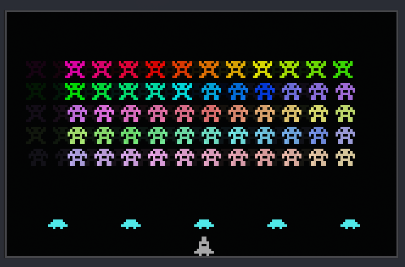

# Space Invaders (Assembly)

For the month of December, 2025, I've challenged myself to learn Assembly. I'm following the tutorials in ["Programming Boot Sector Games"](https://www.amazon.com/Programming-Sector-Games-Toledo-Gutierrez/dp/0359816312/). The game I'm creating is "Invaders", a clone of Space Invaders. 



Learning Assembly like this is interesting. I've had this book for years, but never fully understood the code in it. Now, I get to use AI to help me learn, and it's just like having a Assembly professor sit with me and explain things over and over again to me until I understand. **AI is only being used to explain concepts, not write code.** I think this is the best way to use AI to learn something new.

The book is poorly edited, and many parts can be confusing because the [code often isn't fully explained](https://github.com/nanochess/Invaders/blob/master/invaders.asm). Also, the original intent of the code was to fit in a 512KB boot sector. Because of that, the author has many tricks and optimizations that can make following the code difficult for a beginner. 

I'm going through the original code line-by-line, and using Gemini 3 to explain concepts to me. After I fully understand what the code does, I make a comment on the Assembly instruction in my own words. I'm also changing some of the code to be more readable. Since I'm not trying to fit this in a boot sector, I can be more liberal with the code. For the first time, I feel like I'm learning and understanding Assembly, even though it's taking a while to grasp the concepts. This block of code for example took me about 2 hours to implement and learn exactly what was going on. But now I could explain this block of code to anyone in great detail.


```asm
  mov ax, [level]         ; Loads the level into AL, and lives into AH. The book used `mov ax, [di]` but I think
                          ; [level] is more readable and accomplishes the same thing
  inc ax                  ; Add 1 to the level value in AL. On level 0, AX becomes 0x0401.
  inc ax                  ; Add 1 again. On level 0, AX becomes 0x0402. AL now holds the descent value (2).
  stosw                   ; Store AX into ram at ES:DI so we have a durable copy there
  mov ah, al              ; AX becomes 0x0202 on first run (Why though ... will it be used later ???)
  xchg ax, dx             ; Copies dx to ax and ax to dx. On first run, DX holds 2, which will move the aliens down
                          ;   The only reason I can figure that the author used `xchg` here instead of `mov` was to... 
```

## This project is currently in progress

It will take me most or more of the month of December to finish this. If you're reading this before then, you're viewing code that is in progress. I'm live posting my Git history as I commit it.

## Running the game

To compile as a .com file (for DOSBox):

```bash
nasm -f bin invaders.asm -o invaders.com
```

To run in DOSBox:

```bash
dosbox invaders.com
```

