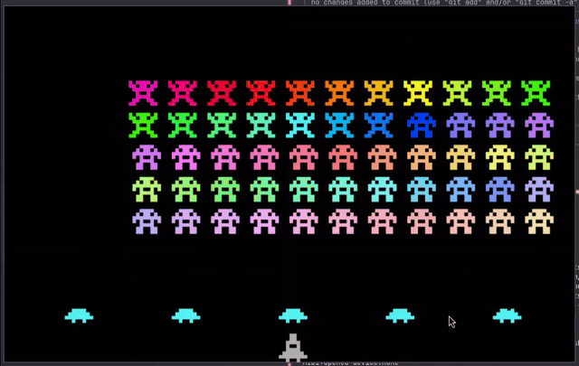

# Space Invaders (Assembly) - Christmas Edition

For the month of December 2025, I challenged myself to learn Assembly. I followed the tutorials in Oscar Toledo Gutiérrez's [Programming Boot Sector Games](https://www.amazon.com/Programming-Sector-Games-Toledo-Gutierrez/dp/0359816312/) to create a version of 1978's Space Invaders. 



I've had Gutiérrez's Assembly book for years, but never fully understood the code in it. But unlike when I started learning in 2022, I now get to use AI to help me learn, and it's just like having an Assembly professor sit with me and explain things over and over again to me until I understand. I didn't vibe-code anything. AI is only being used to explain concepts, not write code. I think this is the best way to use AI to learn something new.

I can also see now that trying to learn Assembly from a book focused on optimizing code with clever tricks was nearly an impossible feat. The code can be confusing because oftentimes it isn't fully explained, as the original intent was to fit the code into a 512-byte boot sector. But between using Gemini 3, reading "Programming Boot Sector Games", and Kip Irvine's 7th edition of [Assembly Language for x86 Processors](https://www.amazon.com/dp/9352869184), I finally feel like I have a grasp on the language.  

I went through [Gutiérrez's original code](https://github.com/nanochess/Invaders/blob/master/invaders.asm) line-by-line, using Gemini 3 to explain concepts to me. Instead of asking questions like "what does `cmp si, ...` do?", I'd annotate the line with what I _thought_ it did, then have Gemini correct me when I was wrong, which I was often, especially early on. Many times I'd have to ask _why_ the author did it. I found asking "why" helped me understand the instruction more deeply than just asking "what". After I fully understood the purpose of the code, I annotated each Assembly instruction in my own words. I also changed some of the code to be more readable. Since I'm not trying to fit this in a boot sector, I can be more liberal with the code. But even with my changes, the final version was just under 700 bytes. 

For the first time, I feel like I'm learning and understanding Assembly, even though it took a while to grasp the concepts. I spent at least 20 hours reading, understanding, and rewriting the code. This block of code for example took me about 2 hours to learn exactly what was going on and write it myself. But now I could explain this block of code to anyone in great detail.

```asm
  mov ax, [level]         ; Loads the level into AL, and lives into AH. The book used `mov ax, [di]` but I think
                          ; [level] is more readable and accomplishes the same thing
  inc ax                  ; Add 1 to the level value in AL. On level 0, AX becomes 0x0401.
  inc ax                  ; Add 1 again. On level 0, AX becomes 0x0402. AL now holds the descent value (2).
  stosw                   ; Store AX into ram at ES:DI so we have a durable copy there
  mov ah, al              ; AX becomes 0x0202 on first run (Why though ... will it be used later ???)
  xchg ax, dx             ; Copies dx to ax and ax to dx. On first run, DX holds 2, which will move the aliens down
```
## Development

Throughout the process, I pushed my code as I made progress. I feel like "live coding" like this is another good way to teach others. Each step of my learning can be found in the commits.

## Running the game

To compile as a .com file (for DOSBox):

```bash
nasm -f bin invaders.asm -o invaders.com
```

To run in DOSBox:

```bash
dosbox invaders.com
```

